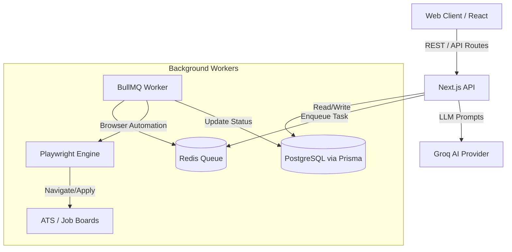

# Architecture Overview

The Automated Job Application Tracker uses a modern, serverless-first architecture optimized for performance, scalability, and developer experience.

## Tech Stack
- **Frontend & API:** Next.js (App Router), Tailwind CSS
- **Database:** PostgreSQL (via Supabase) with Prisma ORM
- **Queue System:** BullMQ + Redis (for handling long-running background tasks)
- **Browser Automation:** Playwright
- **AI Integration:** Groq (LLM Inference)

## System Flow

## Folder Structure Constraints

We adhere to a strict modular folder structure:
- `app/`: Next.js App Router endpoints and pages. No heavy business logic.
- `components/`: Pure React components.
- `lib/`: Business logic, services, database clients. Subfolders represent domains (`ai`, `queue`, `automation`, `analytics`).
- `utils/`: Small, reusable pure functions (formatters, class mergers).
- `docs/`: Developer documentation and architecture records.
- `types/`: Global TypeScript definitions.

## Scalability Considerations
- **Stateless APIs**: All `app/api` routes are stateless, authenticating via session tokens.
- **Background Jobs**: Any task taking >3 seconds (e.g., Playwright scraping, heavy AI generation) is pushed to the BullMQ queue rather than blocking the main thread.
- **Database**: Prisma handles connection pooling, but in a serverless environment, ensure `pgbouncer` or Prisma Accelerate is used if deployed to Lambda/Vercel functions natively.
